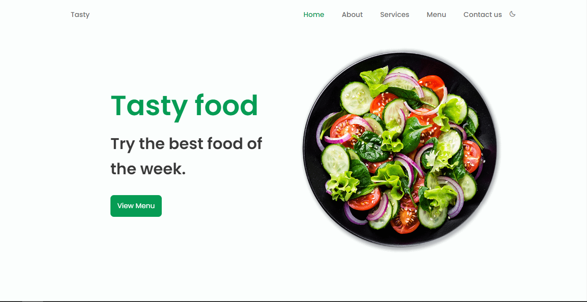
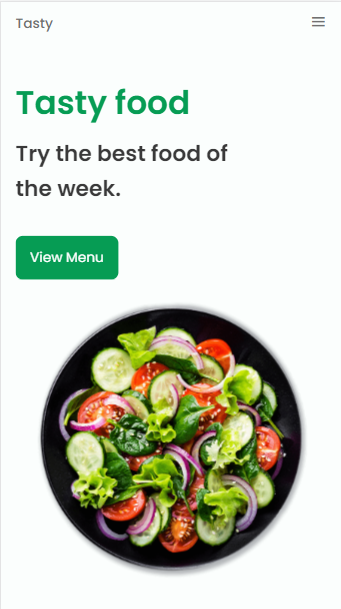

# Responsive Website Restaurant
This Website Is Made Using Html, Css & Javascript. 
You Can Learn Lots Of Things If You Are New / Beginner To The Website Designing / Fontend Devloping.
## [Video Tutorial ▶](https://youtu.be/5RIFrZEjURA)

----
## Feature Descriptions

- Nice design of a responsive restaurant website 🥗 . 

- It contains a header, home, about, services, menu, app, contact and a footer. 

- It also has a fully developed light/dark mode 🌓 first for mobile then for desktop.

-----
## PC View

### Run In Your Local Matchine To View Cool Animation + All Sections Like 
- About
- Services
- Contact
- Contact Us
- Day / Night Theme

- It's A Responsive Website Means, It Will Change it's Layout According To Screen Size, 

## Mobile View

-----

-----
## Follow For 
New Updates / Videos / Posts / Activities 

[Youtube ▶](https://www.youtube.com/c/Bedimcode)
